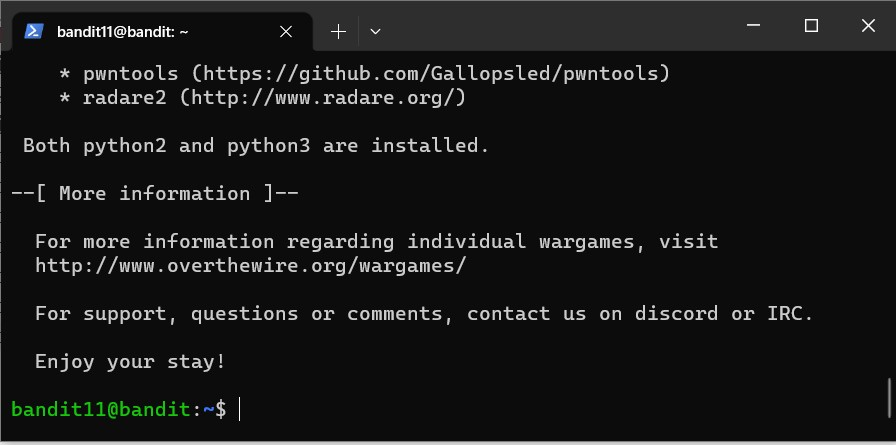

## Commands used to reach _bandit10_ level and their brief descriptions


```powershell
$ ssh bandit0@bandit.labs.overthewire.org -p 2220
```
> *ssh* command gives the instruction to the system to establish an encrypted secure connection with the host machine through the given port.

```powershell
$ ls -la
```
> Command to list all files from the directory, including even hidden ones.

```powershell
$ cat readme
```
> *cat* command reads data from the file and gives its content as output.

```powershell
$ cat "spaces in this filename"
```
> Adding quotation marks around the file name enables the *cat* command to be executed over a file whose name contains blanks.

```powershell
$ cat ./-
```
> Displays the contents of the file named _-_.

```powershell
$ ls inhere -la
```
> The command above lists the content (including hidden files) of the _inhere_ directory.

```powershell
$ cat -- -file*
```
> A double-dash in a shell command signals the end of options and disables further option processing. (source: Baeldung)

```powershell
$ find inhere -type f -readable -size 1033c ! -executable
```
> The *find* command that we used serves to search all files within the _inhere_ directory and to return those files that meet the following 3 criteria: the files are human-readable, the files are not executable (achieved using negation and the *-executable* test flag) and the size of those files is exactly 1033 bytes.

```powershell
$ grep -v '^[[:space:]]*$' inhere/maybehere07/.file2
```

> Printing the contents of a file with spaces and/or blank lines removed.

```powershell
$ find / -user bandit7 -group bandit6 -size 33c 2>&1 | grep -F -v Permission | grep -F -v directory
```

> The above command will search all files owned by user bandit7, group bandit6 and whose size is exactly 33 bytes. (additional command: _cat /var/lib/dpkg/info/bandit7.password_)

```powershell
$ cat data.txt | grep millionth
```

> The command will search the _data.txt_ file and print a line that contains the word _'millionth'_.

```powershell
$ sort data.txt | uniq -u
```

> The above command will return as a result line from the file that is repeated only once.

```powershell
$ strings data.txt | grep ==========
```
> Finds a string that is human-readable and whose preceding chars are equal signs.


### Note!

```LaTex
I found most of the commands from colleagues who had already done this task and from other available online sources. Of course, I further researched the commands and played with them in order to learn them as well as possible.
```

### Evidence of level achievement

*I have saved a screenshot of each level that I have completed to location [Bandit levels](https://github.com/lambda2201/nail-sivro-devops-mentorship/tree/week-2-bandit-labs/week-2/bandit-screenshots) in order to keep this document as clean as possible. Below I will just paste a screenshot of access to level 11.*

